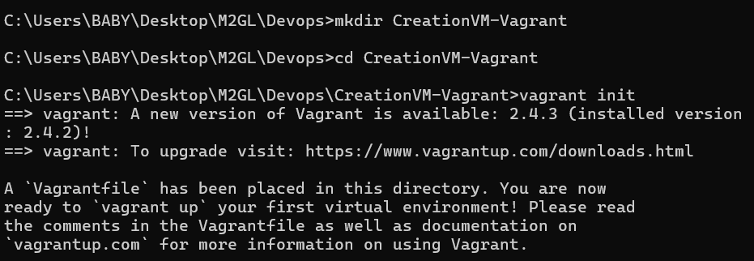
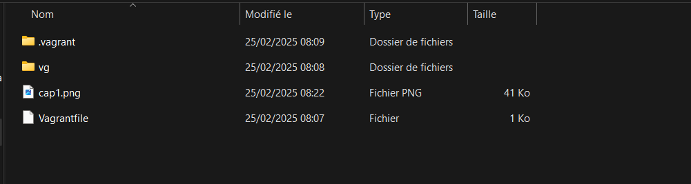
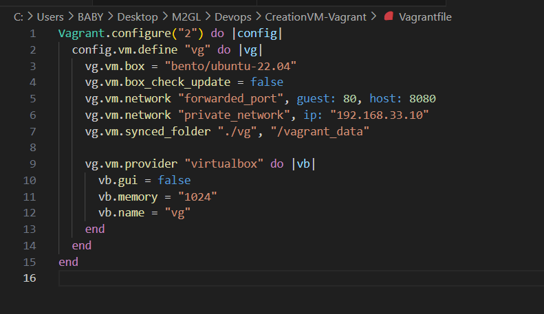
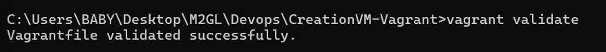
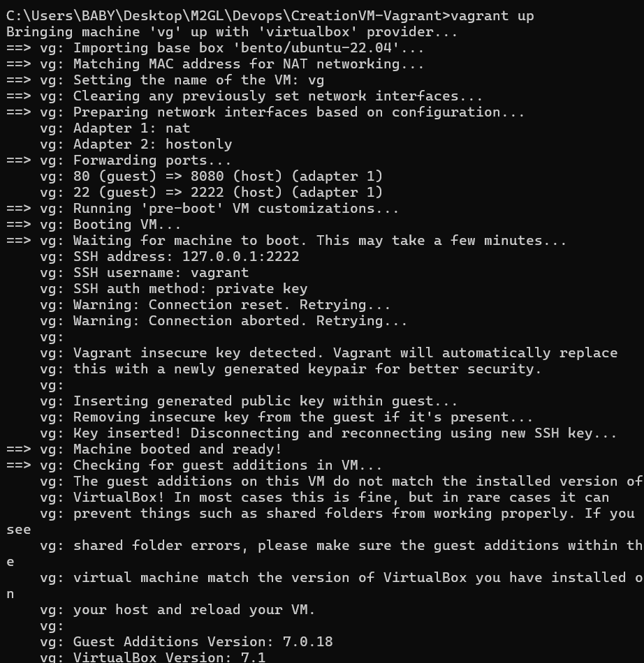
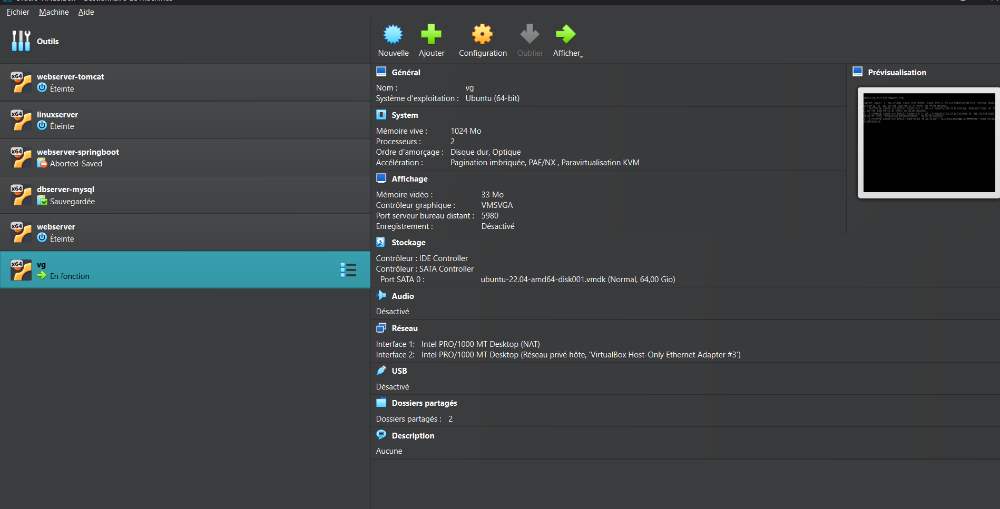
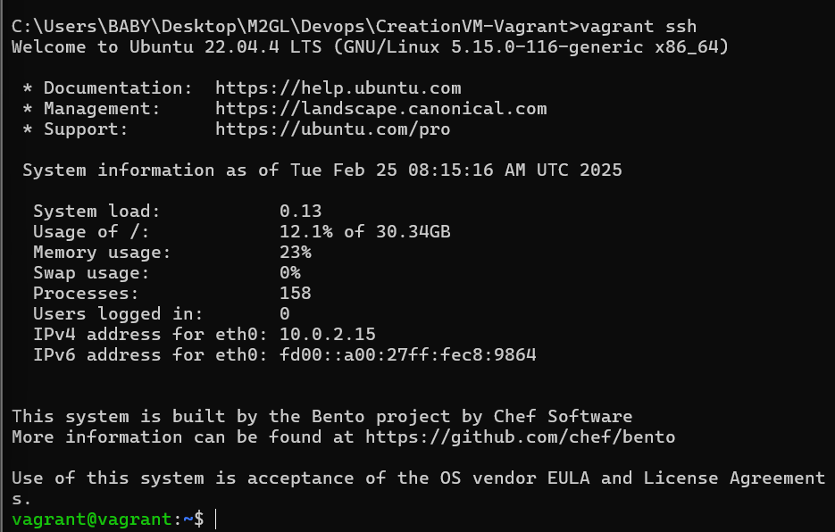

# 1️⃣ Prérequis
Avant de commencer, assurez-vous d'avoir installé :

     Vagrant
    VirtualBox
    Un terminal (CMD, PowerShell, Bash...)
    VSCode


🔧 Initialisation du Projet Vagrant

1️⃣ Créez un répertoire pour votre projet :

```bash
mkdir CreationVM-Vagrant
cd CreationVM-Vagrant
```
2️⃣ Initialisez Vagrant dans ce répertoire :

```bash
vagrant init
```


📝 Cela génère un fichier Vagrantfile de configuration.



⚙ Configuration du Vagrantfile

Modifiez le fichier Vagrantfile pour définir la machine virtuelle souhaitée sur VSCode ou votre éditeur préféré.

Choisissez une box : Visitez Vagrant Cloud et sélectionnez bento/ubuntu-22.04.



✅Validation et Démarrage de la VM

Après avoir configuré le Vagrantfile, vous pouvez valider la configuration avec cette commande pour vérifier si la configuration est correcte.

1️⃣ Validez votre configuration

Cette commande permet de vérifier si la configuration est correcte :

```bash
vagrant validate
```


2️⃣ Démarrez la machine virtuelle

```bash
vagrant up
```




3️⃣ Accédez à la VM via SSH

```bash
vagrant ssh 
```


Après avoir créé votre machine, vous pouvez vous déconnecter .

```bash
exit
```

Pour suspendre la VM :

```bash
vagrant suspend
```
Pour arrêter la VM :

```bash
vagrant halt
```